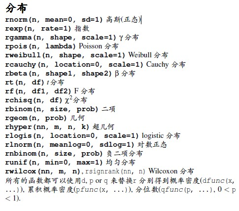

#R Functions

##basic func
***
head()
tail()
names()
ncol()
nrow()
unique():去重复
%in%:是否存在于某个vector中
match(x,y):查找x在y中的位置
sort()
order(a,b,c...):排序，现以a排序，再按b排序

##str
***
compactly display the structure of an R object  

##gl
***

##apply
***

##Generating Random Numbers
***  
各种分布在r中函数如下图  
  
注意使用r时先调用set.seed()

* sample():抽样函数

##System.time()
***
计算一个函数执行需要消耗的时间  
user time:cpu 处理的时间
elapsed time:你等待的时间

##Rprof()
***
by.total
by.self
summaryRprof()